# [ Oracle Complete Scenario ] GI 19c [ASM] DB 19c on [ Oracle Linux 8.6 ]

In this Document we will start with VirtualBox and Oracle Linux 8.6 installation, then move to apply the prerequisites for both GI and DB, after that we going to proceed to Oracle Grid Infrastructure 19c installation with ASM then Oracle 19.3 Database software only installation, Once we finish the installation, we will create database.

## Table of Contents

___

- [[ Oracle Complete Scenario ] GI 19c [ASM] DB 19c on [ Oracle Linux 8.6 ]](#-oracle-complete-scenario--gi-19c-asm-db-19c-on--oracle-linux-86-)
  - [**Requirements:*](#requirements)
  - [Installing VirtualBox.](#installing-virtualbox)
  - [Installing OEL 8.6 in VirtualBox.](#installing-oel-86-in-virtualbox)
    - [Creating Virtual Machine Instance.](#creating-virtual-machine-instance)
    - [Installing OEL 8.6](#installing-oel-86)
    - [Installing Guest Additions.](#installing-guest-additions)
  - [Prepare the OS for the Installation [Prerequisites]](#prepare-the-os-for-the-installation-prerequisites)
  - [Create and Tag ASM Disks.](#create-and-tag-asm-disks)
  - [Installing Oracle Grid Infrastructure 19c Software](#installing-oracle-grid-infrastructure-19c-software)
    - [Creating FRA Disk Group.](#creating-fra-disk-group)
  - [Installing Oracle DB 19c software Only](#installing-oracle-db-19c-software-only)
  - [Create database using dbca.](#create-database-using-dbca)
  - [Verifying the installation.](#verifying-the-installation)

## **Requirements:*

___

1. [Oracle Linux 8.6 ISO](https://yum.oracle.com/ISOS/OracleLinux/OL8/u6/x86_64/OracleLinux-R8-U6-x86_64-dvd.iso).
2. [ASMLib8](https://www.oracle.com/linux/downloads/linux-asmlib-v8-downloads.html) and [oracleasm-support](https://public-yum.oracle.com/repo/OracleLinux/OL8/addons/x86_64/getPackage/oracleasm-support-2.1.12-1.el8.x86_64.rpm).
3. [Oracle 19.3 Grid Infrastructure (GI)](https://www.oracle.com/database/technologies/oracle19c-linux-downloads.html).
4. [Oracle 19.3 Database (DB)](https://www.oracle.com/database/technologies/oracle19c-linux-downloads.html).
5. [VBox](https://www.virtualbox.org/wiki/Downloads) installed.
6. Virtual Machine Resource allocation:
   - 8 GB RAM (Minimum 4GB)
   - 2 Cores [CPU]
   - 80 GB Virtual Disk for OS
   - 8 x 5GB Virtual Disk for ASM

## Installing VirtualBox

___

1. Search "Virtual Box" in Google and click in first Download option:  
    
2. In Platform Packages select Windows Hosts  
    
3. Download will start, save it in Desktop  
      
    
4. Download finished  
    
5. Run the Virtual Box Installer, click Next.  
    
6. Click next.  
    
7. Select only the last checkbox.  
    
8. Accept the warning (you will lost internet connection).  
    
9. Click in Install.  
    
10. The installation begins.  
    
11. The installation completes.  
    
12. Virtual Box is installed.  
    
  
## Installing OEL 8.6 in VirtualBox

### Creating Virtual Machine Instance

___

1. Click on New.
    
2. Change the name to "OEL86" and click Next.  
    
3. Assign 8192 MB(8GB) of RAM. (Minimum 4096 MB(4GB)).  
    
4. Select "Create virtual hard disk now" and click Create.  
    
5. Select VDI (VirtualBox Disk Image).  
    
6. Select Dynamically Allocated and click Next.  
    
7. Assign 80GB to the virtual file disk.  
    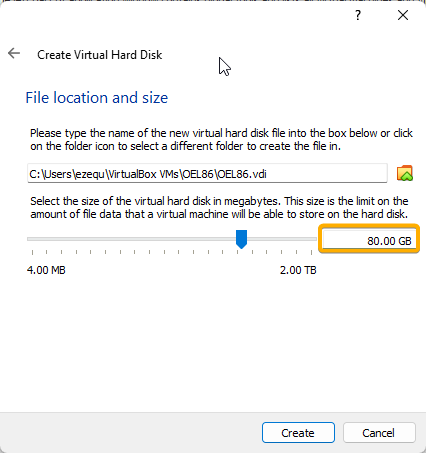
8. Once created, click on Settings.  
    
9. In General > Advanced, set both Shared Clipboard and Drag'n'Drop to Bidirectional.  
    
10. In System > Processor, set 2 Processors.  
    
11. In Storage > Controller: IDE, select the Empty disk.  
    
12. Then select the disk icon to the right.  
    
13. Select "Choose a disk file...".  
    
14. Open the OEL86 ISO file.  
    
15. ISO selected.  
    
16. Now in Controller: Sata select the icon with the plus symbol.  
    
17. Click on Create.  
    
18. Select VDI (VirtualBox Disk Image), click Next.  
    
19. Select Dynamically Allocated, click Next.  
    
20. Change de the disk name to ASMDisk*i* where *i*  will go from 1 to 8. Assign 5GB of size. Click on Create.  
    
21. In the "No attached" section, select the just created virtual disk.  
    
22. Repeat steps 20 and 21 eight times.  
23. 8 disks must be created.  
    
24. In Network > Adapter 1, select Bridged Adapter and the network interface in which you have internet access.  
    
25. In Adapter 2, use the same settings as the previous step. Cick on OK.  
    
26. In the VM Instance, right click on it and select Clone.  
    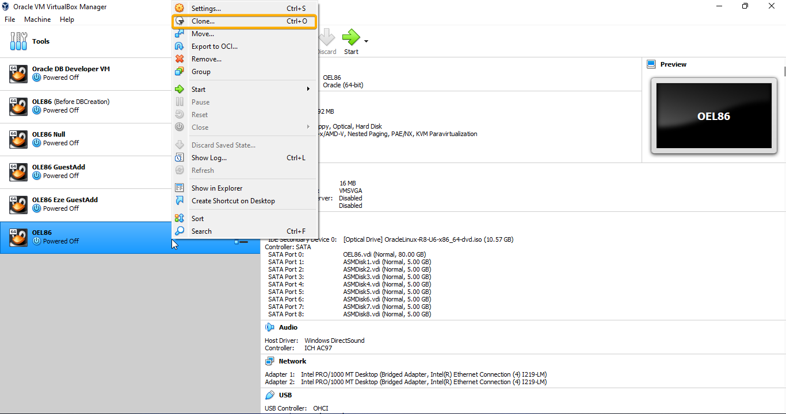
27. Append to the name "Null" and the Keep Disk Names checkbox. This clone will be useful just in case some thing fails during the OS installation.  
    
28. Select Full Clone and click on Clone.  
    
29. Select the original instance and click on Start.  
    

### Installing OEL 8.6

___

1. Select with Intro, Install Oracle Linux 8.6.0.  
    
2. The language must be English. Click on Continue.  
    
3. Click on Keyboard.  
    
4. Click on English (US) then the "-" Icon.  
    
5. Search for your keyboard distribution. In my case, Spanish Latin American. Click on Add.  
    
6. It should be just one distribution. Click on Done.  
    
7. Click on Time & Date.  
    
8. Click on in the time zone you currenty are. In this case, Mexico City. Click on Done.  
    
9. Click on Software Selection.  
    

10. Select Server with GUI as de Base Enviroment. Additiontal Software selection:  
    - Debugging Tools.
    - Performance Tools.
    - Remote Management For Linux.
    - Legacy Unix Compatibility.
    - Container Management.
    - Development Tools.
    - Graphical Administration Tools.
    - RPM Development Tools.
    - Security Tools.
    - System Tools.  
  Click on Done.  
    
11. Click on Installation Destination.  
    
12. Select the 80GB hard disk. Check the Custom checkbox. Click on Done.  
    
13. Click on the "+" Button.  
    
14. Select /boot as the Mount Point and 2 GiB as the Desired Capactity. Click on Add mount point.  
    
15. Click on the "+" Button.  
    
16. Select swap as the Mount Point and 8 GiB as the Desired Capactity. Click on Add mount point.  
    
17. Click on the "+" Button.  
    
18. Select / as the Mount Point and leave blank the Desired Capactity. Click on Add mount point.  
    
19. With the 3 partitions created. Click on Done.  
    
20. Click on Accept Changes.  
    
21. Click on KDUMP.  
    
22. Disable the checkbox and click on Done.  
    
23. Click on Network & Host Name.  
    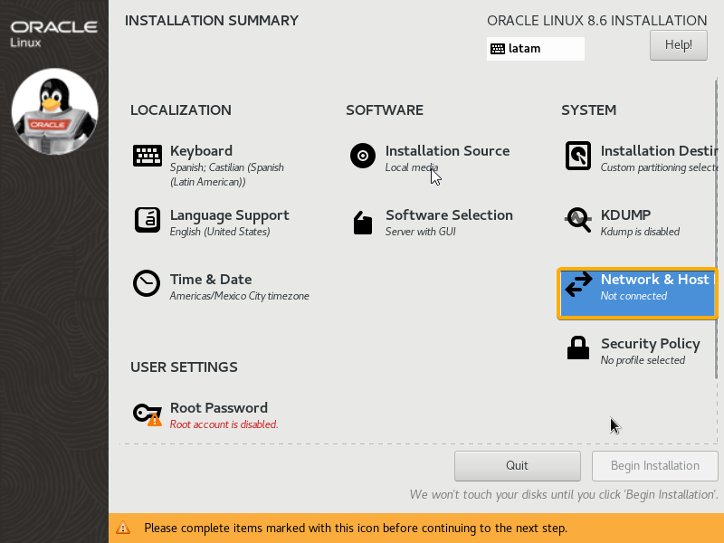
24. Enable the interface, change the host name and click on Apply. Click on Done.  
    name.domain = oracle.itq.edu.mx  
    
25. Click on Security Policy.  
    
26. Turn off the switch and click on Done.  
    
27. Click on Root Password.  
    
28. Set `oracle` as the password. Click twice on Done.  
    
29. Click on Begin Installation.  
    
30. The installation begins.  
    
31. Once finished, click on Reboot System.  
    
32. Click on License Information.  
    
33. Accept the agreement and click on Done.  
    
34. Click on Finish Configuration.  
    
35. Click on Next.  
    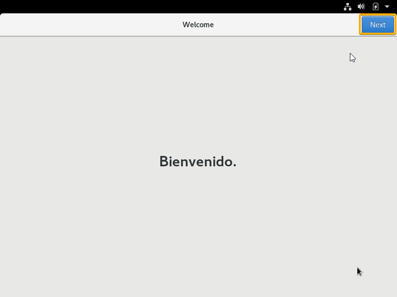
36. Input your Full Name and username. Click on Next.  
    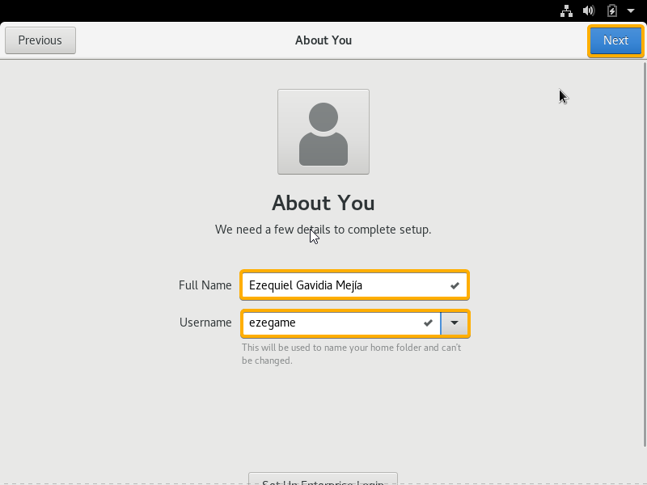
37. Click on Start Using Oracle Linux Server.  
    
38. Close the Getting Started window.  
    
___

1. Open a terminal.  

2. Update all packages with the following command.  

   ```
   sudo yum update -y
   ```  

    
3. Input `oracle` as root password.  
    
4. Input `Y` to confirm the installation.  
    
5. Again `Y` to confirm.  
    
6. Installation completed.  
    
7. Issute the command `uname -r` to check the kernel version.  
   Issue the `yum list kernel*` command and search your kernel version in the output.  
    
8. In my case I will use the version `kernel-uek-devel.x86_64`.  
    
9. Issue the command `sudo yum install kernel-uek-devel.x86_64 -y`.  
    
10. Input the password for root.  
    
11. Input `Y` to confirm the installation.  
    
12. Installation completed.  
    
13. Issue the command `sudo reboot` to reboot the system.  
    
14. Click on VirtualBox Devices and Insert Guest Additions image.  
    
15. Click on Run.  
    
16. Press enter to close the window.  
    
17. Reboot the system.  
18. Now the Virtual Machine should be as width as the host device screen.  
    
19. Open the Settings application.  
    
20. In Power > Power Saving, set Blank Screen to Never.  
    
21. Power off the system.  
22. Right click on the instance and Clone.  
    
23. Append "GuessAdd" to the name and checkbox in Keep Disk Names.  
    
24. Click on Full Clone checkbox and Clone.  
    

25. Start the original instance.  
26. Go to Files app.  
    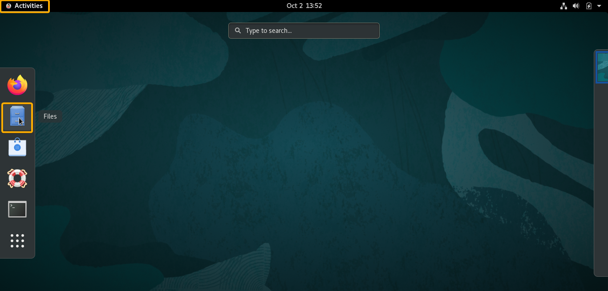  
27. Unmount the VBox Guest Additions cd image clicking on the icon.  
    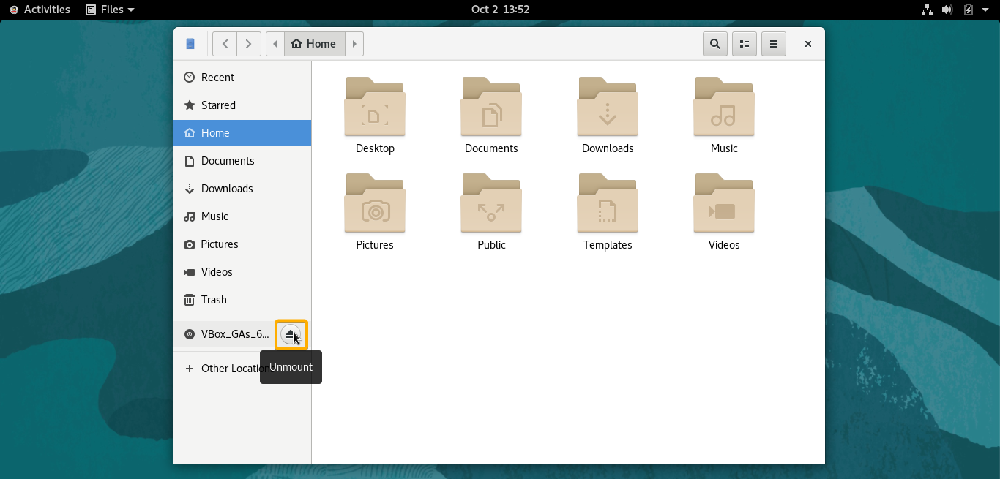  
## Prepare the OS for the Installation [Prerequisites]

___

1. Open a terminal.  
2. Issue the following command and save or remember the interface IP.  
   ```bash
   ifconfig
   ```  
    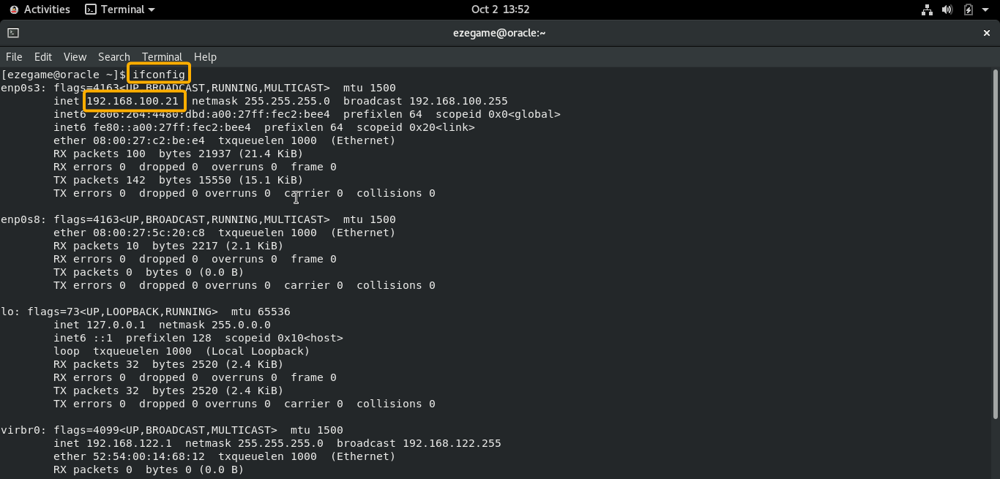  
3. Edit the host file, append the following. Use your IP and the domain name you configured at installation.    
    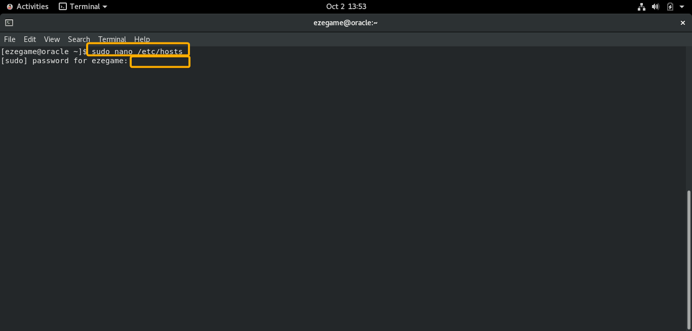  
    ```bash
    sudo nano /etc/hosts
    ```  
    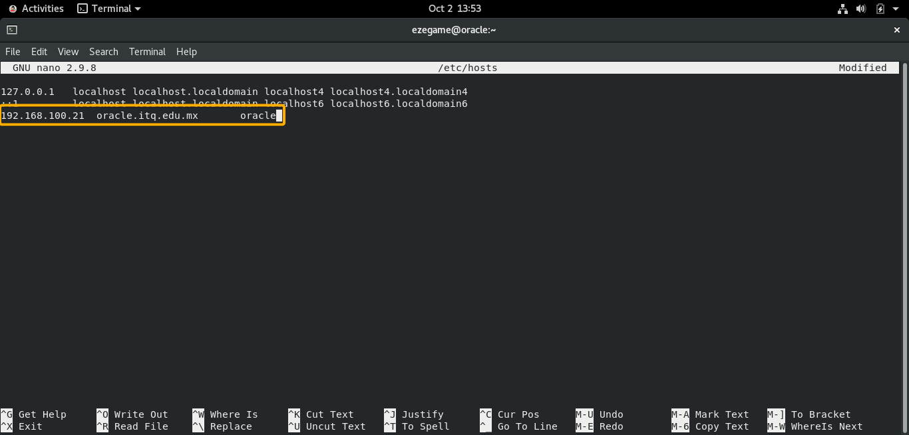  
4. Check the Internet connectivity using:  

    ```bash
    ping www.google.com -c 4
    ```  

    

5. Check cache to download the metadata from online repo:  

    ```bash
    dnf makecache
    ```  

    

6. Install prerequisites, enter the password:  

    ```bash
    sudo dnf install oracle-database-preinstall-19c -y 
    ```  

      
    

7. Login with root and input the password.  

    ```bash
    sudo -i
    ```  

8. Create OS groups for asm administration and operation:  

    ```bash
    groupadd -g 54327 asmdba
    groupadd -g 54328 asmoper
    groupadd -g 54329 asmadmin
    ```  

      

9.  Add as secondary group to oracle user:  

    ```bash
    usermod -a -G asmadmin,asmdba,wheel oracle
    ```  

      

10. Create Grid user:  

    ```bash
    useradd -u 54331 -g oinstall -G dba,asmdba,asmadmin,asmoper,racdba,wheel grid
    ```  

      

11. Change the password for Oracle and Grid user to `oracle`:  

    ```bash
    passwd oracle
    ```  

    ```bash
    passwd grid
    ```  

      
      

12. Create the Directories for the Oracle Grid installation  

    ```bash
    mkdir -p /u01/19c/oracle_base
    mkdir -p /u01/19c/oracle_base/oracle/db_home
    chown -R oracle:oinstall /u01
    ```  

      

13. Create the Directories for the Oracle Database installation.  

    ```bash
    mkdir -p /u01/19c/grid_base
    mkdir -p /u01/19c/grid_home
    chown -R grid:oinstall /u01/19c/grid_base /u01/19c/grid_home
    chmod -R 775 /u01
    ```  

      

14. Switch to the `grid` user and edit the Grid `.bash_profile`, before edit the file I will take backup for it first.  

    ```bash
    su - grid
    ```  

    ```bash
    cd /home/grid
    cp .bash_profile .bash_profile.bkp
    ```  

      

15. Copy and paste this to grid home directory.  

    ```bash
    cat > /home/grid/.grid19c_env <<EOF
    # User specific environment and startup programs
    ORACLE_SID=+ASM; export ORACLE_SID
    ORACLE_BASE=/u01/19c/grid_base; export ORACLE_BASE
    ORACLE_HOME=/u01/19c/grid_home; export ORACLE_HOME
    ORACLE_TERM=xterm; export ORACLE_TERM
    JAVA_HOME=/usr/bin/java; export JAVA_HOME
    TNS_ADMIN=\$ORACLE_HOME/network/admin; export TNS_ADMIN
    PATH=.:\${JAVA_HOME}/bin:\${PATH}:\$HOME/bin:\$ORACLE_HOME/bin
    PATH=\${PATH}:/usr/bin:/bin:/usr/local/bin
    export PATH
    umask 022
    EOF
    ```  

      

16. Apply the profile for the current session and check the environment variables:  

    ```bash
    echo "source ~/.grid19c_env" >> ~/.bash_profile
    exit
    ```

    ```bash
    su - grid
    ```  

    ```bash
    env | grep -i oracle
    ```  

      

17. Switch to `oracle` user and backup the `.bash_profile` :  

    ```bash
    su - oracle 
    ```  

    ```bash
    cp .bash_profile .bash_profile.bkp
    ```  

      
      

18. Create new bash profile file copy the below script to your terminal and press enter:  

    ```bash
    cat > /home/oracle/.db19c_env <<EOF
    # specific environment and startup programs
    ORACLE_HOSTNAME=\$HOSTNAME; export ORACLE_HOSTNAME
    ORACLE_SID=prod; export ORACLE_SID
    ORACLE_UNQNAME=prod; export ORACLE_UNQNAME
    ORACLE_BASE=/u01/19c/oracle_base; export ORACLE_BASE
    ORACLE_HOME=\$ORACLE_BASE/oracle/db_home; export ORACLE_HOME
    ORACLE_TERM=xterm; export ORACLE_TERM
    JAVA_HOME=/usr/bin/java; export JAVA_HOME
    TNS_ADMIN=\$ORACLE_HOME/network/admin; export TNS_ADMIN
    PATH=.:\${JAVA_HOME}/bin:\${PATH}:\$HOME/bin:\$ORACLE_HOME/bin
    PATH=\${PATH}:/usr/bin:/bin:/usr/local/bin
    NLS_DATE_FORMAT="DD-MON-YYYY HH24:MI:SS"; export NLS_DATE_FORMAT
    TNS_ADMIN=\$ORACLE_HOME/network/admin; export TNS_ADMIN
    PATH=.:\${JAVA_HOME}/bin:\${PATH}:\$HOME/bin:\$ORACLE_HOME/bin
    PATH=\${PATH}:/usr/bin:/bin:/usr/local/bin
    TEMP=/tmp ;export TMP
    TMPDIR=\$tmp ; export TMPDIR
    export PATH
    umask 022
    EOF
    ```  

      

19. Test.  

    ```bash
    . .db19c_env
    env | grep -i oracle
    ```  

      

20. Apply the profile.  

    ```bash
    echo "source ~/.db19c_env" >> ~/.bash_profile
    exit
    ```  

    ```bash
    su - oracle
    ```  

    ```
    env | grep -i oracle
    ```

      

21. Login with root and input the password.  

    ```bash
    sudo -i
    ```  

22. Check the NTP service  

    ```bash
    systemctl status chronyd
    ```  

23. If the service is inactive, issue the following commands:  

    ```bash
    systemctl start chronyd
    systemctl enable chronyd
    ```  

      

24. Set secure linux to permissive  

    ```bash
    # change SELINUX=enforcing to SELINUX=permissive
    sed -i s/SELINUX=enforcing/SELINUX=permissive/g /etc/selinux/config
    cat /etc/selinux/config
    ```  

    ```bash
    # create limitation in security forlder for grid user 
    cp /etc/security/limits.d/oracle-database-preinstall-19c.conf /etc/security/limits.d/grid-database-preinstall-19c.conf
    ```  

    ```bash
    # rename oracle with grid in this file grid-database-preinstall-19c.conf
    # use vim 
    vim /etc/security/limits.d/grid-database-preinstall-19c.conf
    ```

    ```vim
    :%s/oracle/grid/g  
    :x
    ```  

      
      
    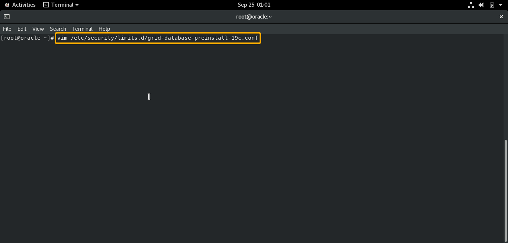  
      
      

25. Disable Linux firewall [ref-link](https://www.ateam-oracle.com/opening-ports-in-linux-7-firewalls-for-oracle-analytics-cloud-access-to-databases-and-remote-data-connector).  

    ```bash
    systemctl stop firewalld
    systemctl disable firewalld
    ```  

      

26. At this point you want to create a Snapshot or a clone of the instance.  

## Create and Tag ASM Disks

___

1. Download [ASMLib8](https://www.oracle.com/linux/downloads/linux-asmlib-v8-downloads.html).  

2. Download [oracleasm-support](https://public-yum.oracle.com/repo/OracleLinux/OL8/addons/x86_64/getPackage/oracleasm-support-2.1.12-1.el8.x86_64.rpm).  

3. Go to the downloads folder.

    ```bash
    cd Downloads
    ```  

4. Install the packages with the following command.  

    ```bash
    sudo yum localinstall ./oracleasm-support-2.1.12-1.el8.x86_64.rpm ./oracleasmlib-2.0.17-1.el8.x86_64.rpm -y
    ```  

    **Versions may vary*
      
      
      

5. Reboot the system.  
6. Login with root and input the password.  

    ```bash
    sudo -i
    ```  

    
7. Start configuring ASM with the following command.  

    ```bash
    oracleasm configure -i
    ```  

      

8. Issue the following command:  

    ```bash
    oracleasm init
    ```  

      

9. List the disk to tag:  

    ```bash
    cd /dev/
    pwd
    ls | grep sd
    ```  

      

10. Format the disks from *b* to *i*:  

    ```bash
    fdisk /dev/sd*i*
    p
    n
    p
    1
    [intro]
    [intro]
    w
    ```  

    ```bash
    fdisk /dev/sdb
    fdisk /dev/sdc
    fdisk /dev/sdd
    fdisk /dev/sde
    fdisk /dev/sdf
    fdisk /dev/sdg
    fdisk /dev/sdh
    fdisk /dev/sdi
    ```  

      

11. Check the formated disks.  

    ```bash
    ls | grep sd
    ```  

      

12. Tag the formatted disks as ASM Disks.  

    ```bash
    oracleasm createdisk ASMDISK1 /dev/sdb1
    oracleasm createdisk ASMDISK2 /dev/sdc1
    oracleasm createdisk ASMDISK3 /dev/sdd1
    oracleasm createdisk ASMDISK4 /dev/sde1
    oracleasm createdisk ASMDISK5 /dev/sdf1
    oracleasm createdisk ASMDISK6 /dev/sdg1
    oracleasm createdisk ASMDISK7 /dev/sdh1
    oracleasm createdisk ASMDISK8 /dev/sdi1
    ```  

      

13. Check the created ASM disks.  

    ```bash
    oracleasm listdisks
    ```  

      

## Changing Kernel Parameter Values

___

1. Make sure you are root.

   ```bash
   sudo -i
   ```  

2. Apply the following configuration command.

    ```bash
    cat > /etc/sysctl.d/97-oracle-database-sysctl.conf <<EOF
    fs.aio-max-nr = 1048576
    fs.file-max = 6815744
    kernel.shmall = 2097152
    kernel.shmmax = 4294967295
    kernel.shmmni = 4096
    kernel.sem = 250 32000 100 128
    net.ipv4.ip_local_port_range = 9000 65500
    net.core.rmem_default = 262144
    net.core.rmem_max = 4194304
    net.core.wmem_default = 262144
    net.core.wmem_max = 1048576
    EOF
    ```  

3. Change the current values of the kernel parameters:

    ```bash
    /sbin/sysctl --system
    ```  

4. Reboot the system.

   ```bash
   reboot
   ```  

## Installing Oracle Grid Infrastructure 19c Software

___

1. Open a terminal and switch to the `grid` user and input the password.  

    ```bash
    su - grid
    ```  

    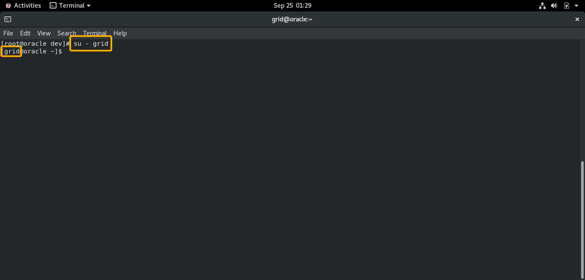  

2. Change to home directory.  

   ```bash
   cd $ORACLE_HOME
   ```  

     

3. Download the [Oracle Grid 19c Software](https://www.oracle.com/database/technologies/oracle19c-linux-downloads.html).  
      
      
      
      
      

4. Open a Terminal New Window and go to the Downloads folder.  

   ```bash
   cd Downloads
   ```

5. Move the Oracle Grid 19c zip file to grid user home directory.  

   ```bash
   sudo mv LINUX.X64_193000_grid_home.zip /u01/19c/grid_home/
   ```  

6. Get back to the grid user terminal.  

7. Unzip the Oracle Grid 19c Software.  

    ```bash
    unzip LINUX.X64_193000_grid_home.zip
    ```  

      

8. Issue the command:  

    ```bash
    export CV_ASSUME_DISTID=OEL8.6
    ```  

      

9. Run the installer.  

    ```bash
    ./gridSetup.sh
    ```  

      

10. If the output is:  

    ```bash
    ERROR: Unable to verify the graphical display setup. This application requires X display. Make sure that xdpyinfo exist under PATH variable.
    ```  

    Close the terminal and repeat steps 1, 2 and 5.  

11. Select Configure Oracle Grid Infrastructure for a Standalone Server (Oracle Restart).  
      

12. Select 1MB size Allocation Unit.  
      

13. Select Change Disk Discovery Path, input `/dev/oracleasm/disks` and click on OK.  
      
      

14. Select the first 4 disks and click Next.  
      

15. Select the Use same password for these accouts checkbox. Input `oracle` as the password. Click on Next. Ignore the warning.  
      
      

16. Click on Next.  
      

17. Click on Next.  
      

18. Click on Next.  
      

19. Click on Next.  
      

20. Click on Next.  
      

21. Select the missing requisite and click on Fix and Check Again.  
      

22. Copy the path to the script to execute.  
      

23. Open a terminal and login with root.  

    ```bash
    sudo -i
    ```  

      

24. Paste the path to the script and execute it.  
      

25. Get back to the Grid Installation and Click on OK.  
      

26. Click on Install.  
      

27. If prompt to execute scripts, copy the paths to the scripts and run them in the root terminal.  
      
      

28. Get back to the installation and click on OK.  
      

29. Installation is completed.  
      

### Creating FRA Disk Group

___

1. Open ASM Configuration Assistant.  

   ```bash
   asmca
   ```  

     

2. Expand Disk Groups. Click on Create.  
      

3. Use `FRA` as the Disk Group Name. Select External Redundancy. Select 1MB Allocation Unit Size. Select the 4 disks available. Finally Click on OK.  
     

4. There will be 2 Disk Groups.  
     

5. You might want to create a Snapshot or a clone of the instance before installing Oracle Database.  

## Installing Oracle DB 19c software Only

___

1. Switch to the `oracle` user and input the password.  

    ```bash
    su - oracle
    ```  

      

2. Change to home directory.  

   ```bash
   cd $ORACLE_HOME
   ```  

     

3. Download [Oracle Database 19c](https://www.oracle.com/database/technologies/oracle19c-linux-downloads.html).  
      
      
      
      
      

4. Open a Terminal New Window and go to the Downloads folder.  

   ```bash
   cd Downloads/
   ```

5. Move the Oracle Database 19c zip file to oracle user home directory.  

   ```bash
   sudo mv LINUX.X64_193000_db_home.zip /u01/19c/oracle_base/oracle/db_home
   ```  

6. Get back to the oracle user terminal.  
7. Unzip the oracle database 19c zipped files in the home dir location:  

    ```bash
    unzip LINUX.X64_193000_db_home.zip
    ```  

8. Run the following command:  

    ```bash
    export CV_ASSUME_DISTID=OEL8.6
    ```  

      

9. Run the installer.  

    ```bash
    ./runInstaller
    ```  

      

11. Select the Set up software only checkbox. Click on Next.  
     

12. Select Single instance database installation. Click on Next.  
      

13. Select Enterprise Edition. Click on Next.  
      

14. Click on Next.  
      

15. Click on Next.  
      

16. Click on Next.  
      

17. If any warnings, click on it, and click on Fix and Check Again.  
      

18. Copy the path to the script and run it as root.  
      
      
      

19. Get back to the installation and click on OK.  
      

20. Click on Install.  
      

21. When prompt to run root scripts. Copy the path to the script and run it as root.  
      
      

22. Get back to the installation and click on OK.  
      

23. Installation is completed.  
      

## Create database using dbca

___

1. Open the DataBase Configuration Assistant.  

   ```bash
   dbca
   ```  

      

2. Select Create a Database and click on Next.  
      

3. Select Advanced Configuration and click on Next.  
      

4. Click on Next.  
     

5. Click on Next.  
     

6. Select Use following for the database storage attributes. Browse for Database file location and select `DATA` Disk Group. Click on Next.  
      
      
      

7. Select Specify Fast Recovery Area, browse for Fast Recovery Area and select FRA Disk Group. Set a 10809 MB Fast Recovery Area size. Click on Next.  
      
      
      

8. Click on Next.  
      

9. Click on Next.  
      

10. Set a SGA Size of 529 MB and a PGA Size of 100 MB.  
      

11. Go to Sample Schemas adn enable Add sample schemas to the database checkbox. Click on Next.  
      

12. Disable the checkboxes and click on Next.  
      

13. Select Use the same adminsitrative password for all accounts. Set `oracle` as the password. Click on Next.  
      

14. Click on Yes to continue.  
      

15. Select Create database and click on Next.  
    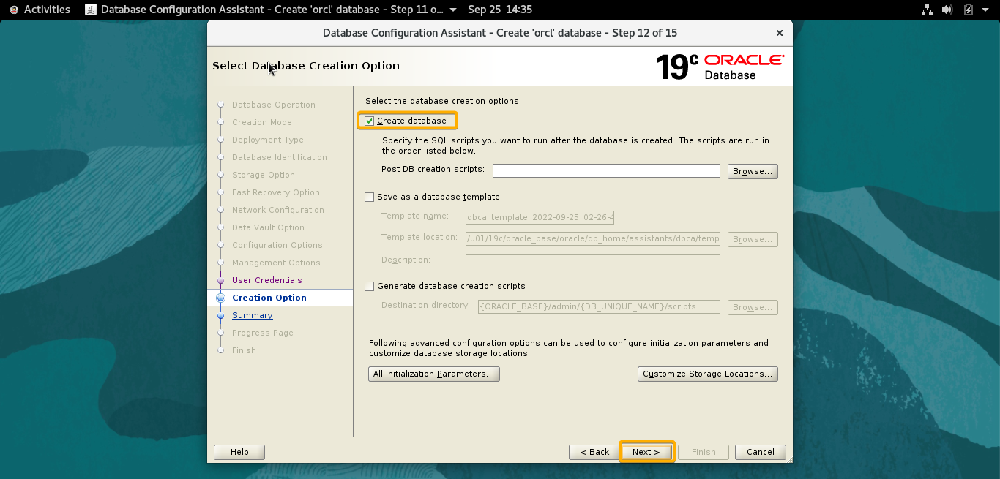  

16. Click on Finish  
      

17. The Database is created.  
      

## Verifying the installation

___

1. Eviroment.  

   ```bash
   . oraenv
   orcl
   ```  

     

2. Login in SQL*Plus.  

   ```bash
   sqlplus
   sys as sysdba
   oracle
   ```  

      

3. Test the following queries.  

   ```sql
   select instance_name from v$instance;
   select name from v$controlfile;
   ```  

     
